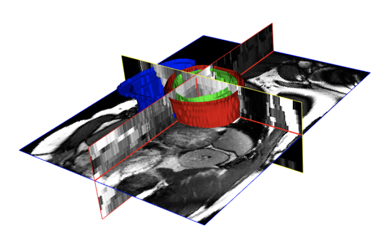
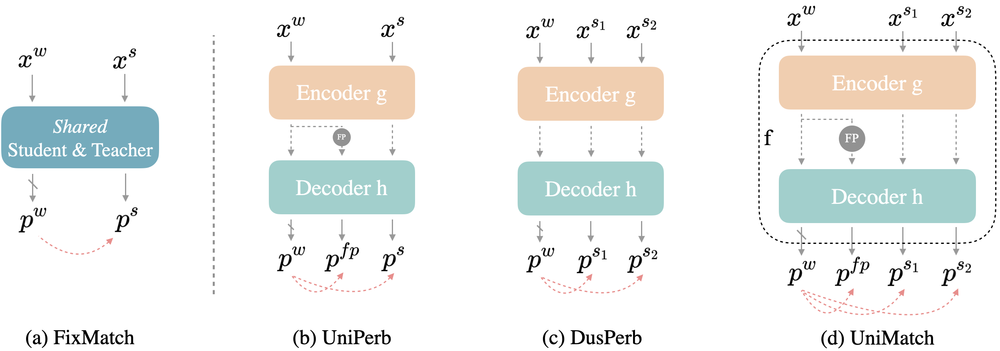
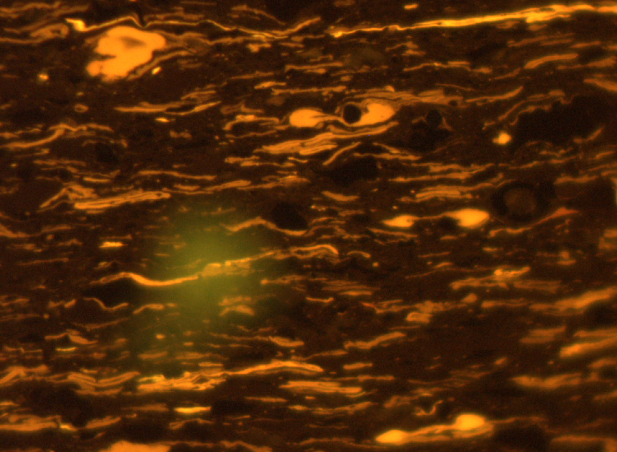

# Semantic Segmentation using Semi-Supervised Learning
## Medical Application: ACDC Dataset

**Task:** Segmenting right ventricle, myocardium and left ventricle

Reproduced results from the paper [UniMatch](https://arxiv.org/abs/2208.09910) and baselined it with supervised learning: 

| Method                | 1 case | 3 cases | 7cases |
|:---------------------:|:------:|:-------:|:------:|
| UNet                  | 28.5   | 41.5    | 62.5   |
| UniMatch (original)   | 85.4   | 88.9    | 89.9   |
| UniMatch (my version) | 84.2   | 87.6    | 89.2   |

[Original UniMatch repo](https://github.com/LiheYoung/UniMatch)

## Method
- Implemented FixMatch uses pseudo-labelling for self training using consistency regularization
- Developed on FixMatch to include dual consistency regularization and better augmentations including CutMix, ClassMix and feature level perturbations

## Adaptation: Mineral Segmentation
Part of a competition organized by Think Onwards: [Stranger Sections 2](https://thinkonward.com/app/c/challenges/stranger-sections-2)

**Task:** Segment out minerals called kerogens from microscopic rock slides. \
**Purpose:** Finding kerogens is a sign of nearby natural resources like oil, petroleum 

### Sample image from the dataset:

The bright yellow patterns are to be segmented out
### Results
| Method | mIoU | Improvement (From Baseline) |
|:-:|:-:|:-:|
| Baseline | 0.28 | - |
| Supervised | 0.40 | 43% |
| FixMatch | 0.46 | 64% |
| UniMatch | 0.48 | 71% |
| UniMatch (More augmentations) | 0.49 | 75% |

- Ray Tune was used for extensive hyperparameter search which helped secure us in top 50 among 300 participants.
